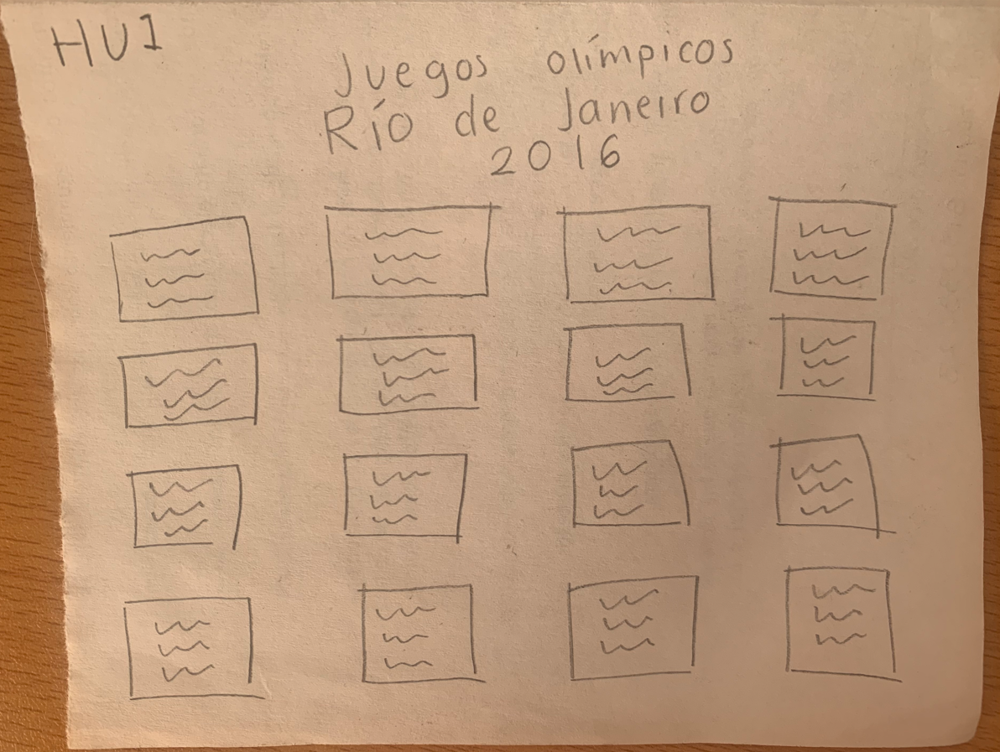
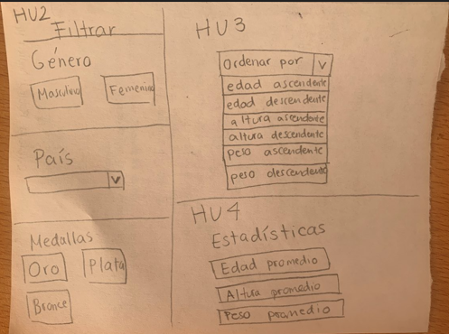
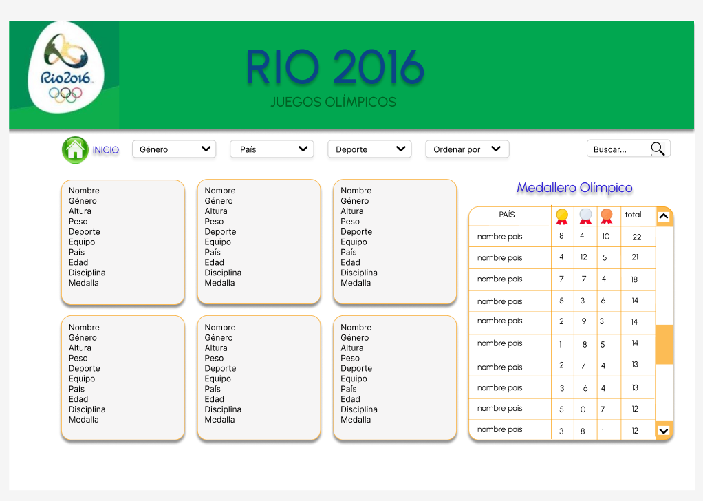
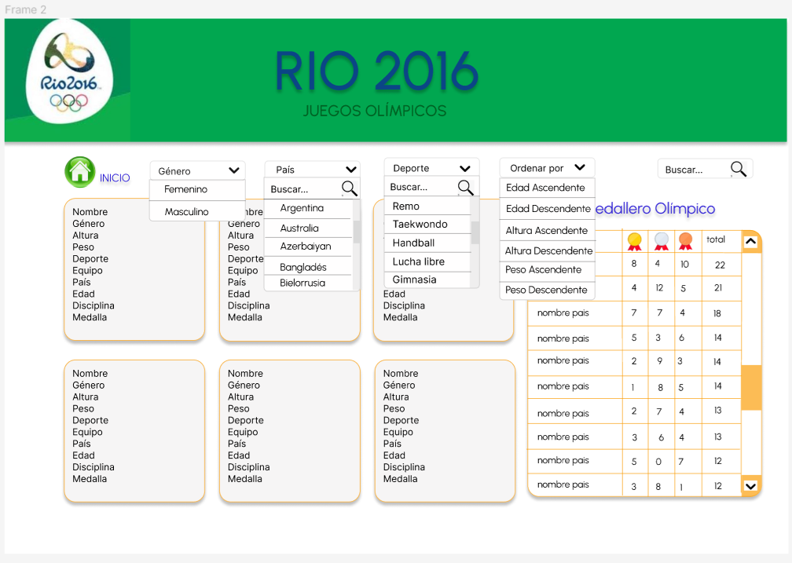

# Data Lovers

## Índice

* [1. Preámbulo](#1-preámbulo)
* [2. Resumen del proyecto](#2-resumen-del-proyecto)
* [3. Funcionalidades del Proyecto](#3-funcionalidades-del-proyecto)
* [4. Consideraciones técnicas](#4-consideraciones-técnicas)
* [5. Historias de usuario](#5-historias-de-usuario)
* [6. Diseño de la API](#6-diseño-de-la-api)
* [7. Documentación Oficial](#7-documentación-oficial)

***

## 1. Preámbulo

Juegos Olímpicos de Río de Janeiro, fueron un evento multideportivo internacional, celebrado en la ciudad de Río de Janeiro, Brasil. La elección de Río marcó la primera vez que se realiza en un país sudamericano. Este evento tuvo gran acogida a nivel mundial. El evento se llevó a cabo del 5 al 21 de agosto 2016, participaron 11,238 atletas de 207 equipos en un total de 306 eventos.

El emblema de Rio 2016 está inspirado en la visión de los organizadores, que es: "Todos los brasileños unidos para ofrecer el mejor festival del planeta y avanzar de forma orgullosa en nuestra promesa nacional de progreso". Tiene, en su esencia, los conceptos de pasión y transformación que están reflejados en el Brasil moderno.

Con un diseño que celebra la relación entre la fuerza de los héroes olímpicos y las fuerzas de la naturaleza, las medallas de oro, plata y bronce de 500 gramos se hicieron teniendo en cuenta la sostenibilidad. Las medallas de plata y bronce se han fabricado con un 30% de materiales reciclados y las cintas con un 50% de PET reciclado. Por su parte, las medallas de oro eran completamente libres de mercurio; en total fueron 812 medallas de oro, 812 medallas de plata y 864 medallas de bronce.

## 2. Resumen del proyecto

Este proyecto es una aplicación dirigida a los aficionados deportivos que tienen interés por conocer a los medallistas en los juegos olímpicos de 2016. Para esto creamos un sitio que muestra a todos los ganadores de las olimpiadas de ese año, y algunos filtros para que los usuarios sean capaces de acceder a los atletas según los criterios de su interés.
Los filtros que incluye la aplicación son los siguientes:

* Género
* País
* Deporte

Así mismo hay una función para ordenar a los atletas de manera ascendente y descendente de acuerdo con:

* Edad
* Altura
* Peso

También hay un buscador donde los usuarios pueden introducir el nombre o apellido de los atletas para encontrar la data correspondiente.

Por último se muestra una tabla con el medallero de los 10 paises con mayor número de medallas.


## 3. Funcionalidades del Proyecto

Al ingresar, la interfaz permite visualizar la data completa de los atletas exhibida en tarjetas individuales que muestran sus datos generales y medallas obtenidas.

La aplicación filtra las tarjetas de los atletas dependiendo de si son género femenino ó masculino, si pertenecen a un país específico, y el tipo de deporte que practican.

Además la aplicación ordena los atletas por edad, altura y peso de mayor a menor.

El sitio tiene un buscador de atletas que devuelve solo las tarjetas con el nombre buscado.

Dentro del aside de esta API podemos encontrar un breve resumen sobre los juegos olímpicos, así como una tabla denominada "Medallero" con las cifras de los diez paises con más medallas obtenida a través de una reducción del total de medallas ganadas por país.


## 4. Consideraciones técnicas

La lógica del proyecto esta implementada en JavaScript, HTML y  CSS. El proyecto esta organizado en los siguientes archivos:

### `src/index.html`

Dentro este archivo se utilizaron las siguientes etiquetas semánticas:
```
* Header: contiene el logotipo de Río 2016 y dos etiquetas de encabezados <h1> y <h2> para el título.

* Body: contiene las etiquetas semánticas <section><main ><aside><footer> adémas de un contenedor <div> para las barras desplegables de las funcionalidades para filtros y ordenamientos, las cuales se conforman de <select> y <option>; 

* Section: contiene un display flex para poder manipular dos contenedores <main> y <aside>.

* Main: contiene un display flex para posicionar las tarjetas de cada atleta con la propiedad flex-wrap.

* Aside: contiene una etiqueta <article>, así como un contenedor <div> que a su vez contien un elemento <table>.

* Footer: contiene la imagen del logo de los juegos olímpicos y los créditos de las desarrolladoras.
```

### `src/main.js`

Dentro de este archivo esta la manipulación del DOM y las funciones de JavaScript para mostrar la data en pantalla.

En este archivo esta el código para:

* Alimentar las barras desplegables,
* Mostrar todas las tarjetas de los atletas,
* Escuchar los eventos de las barras desplegables,
* Escuchar el evento de escritura de la barra de búsqueda,
* y crear y alimentar la tabla con los datos correspondientes al medallero.


### `src/data.js`

En este archivo tenemos las funciones puras con las que manipulamos datos a tráves de arreglos y objetos.

Los métodos que se utilizaron fueron los siguientes:

* filter(): esta método se utiliza para las funciones: 

  * femaleFilter,
  * maleFilter,
  * teamFilter,
  * sportFilter.
  
  Recibe la data y retorna los datos que cumplen con la condición en cuestión.

* sort(): este método se utilizó para las funciones: 
  * orderAgeAscendant,
  * orderAgeDescendant,
  * orderHeightAscendant,
  * orderHeightDescendant, 
  * orderWeightAscendant,
  * orderWeightDescendant.

  Recibe la data y retorna la misma lista ordenada de acuerdo con alguno de los campos de la data.

* reduce(): este método se utilizó para las siguientes funciones:
  * totalMedalsByTeam,
  * orderMedalsTopTen.

  En la primera función recibe la data de todos los atletas y lo reduce a un objeto con los atletas por país.

  En la segunda función reduce la data a las medallas obtenidas por país.
  

### `src/data`
En este archivo se encuentra la carpeta con la data que se manipula en esta API correspondiente a los atletas.


### `test/data.spec.js`
En este archivo se encuentran todas las pruebas unitarias de las funciones puras implementadas en el archivo data.js

Para realizar estas pruebas se declararon algunas constantes con fragmentos de la data del archivo data para después reutilizarlas en la ejecución de los test.

Las pruebas unitarias consisten en una comparación entre lo que se recibe y lo que se espera de una función.

## 5. Historias de usuario

### Historia de usuario número 1 "VISUALIZAR DATA":

yo como aficionado sudamericano  al deporte interesado por los medallistas olímpicos

quiero visualizar la información deportiva de los juegos olímpicos de Rio de Janeiro

para conocer los datos específicos de los atletas sudamericanos.

#### Criterios de aceptación:

La aplicación le permite al usuario visualizar los datos (nombre, país, deporte, estatura, peso, etc) de todos los medallistas de Río de Janeiro 2016.

### Historia de usuario número 2 "FILTRAR DATA":

yo como aficionado sudamericano  al deporte interesado por los medallistas olímpicos

quiero filtrar los datos del evento deportivo

para conocer los datos de los atletas que más me interesan, osea los de mi región.

#### Criterios de aceptación:

La aplicación retorna la data seleccionada que cumple con la condición de la data recibida.

### Historia de usuario número 3 "ORDENAR DATA":

yo como aficionado sudamericano  al deporte interesado por los medallistas olímpicos

quiero ordenar la base datos para conocer obtener los datos de edad, altura, peso de forma ascendente y descendente.

#### Criterios de aceptación:

La aplicación entrega la data, muestra el campo que se quiere ordenar, e indica si se ordena de forma ascendente o descendente.

### Historia de usuario número 4 "CÁLCULO AGREGADO":

yo como aficionado al deporte

quiero realizar cálculos sobre el número de medallas ganadas en cada país.

para conocer a los países que tuvieron atletas con mejor desempeño.

Criterios de aceptación:

·        hacer cálculos estadísticos sobre la data seleccionada.


### Definition of Done

Todas las historias de usuario contiene la misma "definition of Done" que se compone por los siguientes criterios:

* Usabilidad, funcionalidad de la app de forma responsive.

* El producto sigue los estándares de calidad de diseño visual.

* El README se encuentra documentado.

* Se realiza commit en github.

* Se ha solicitado Feedback a usuarios.


## 6. Diseño de la API 

Primero se llevó a cabo una investigación sobre los usuarios a partir de los hallazgos otorgados. Con esta información en mente se realizaron bocetos de las funcionalidades de la interfaz, mismas que fueron aterrizadas en las cuatro historias de usuario del apartado anterior; las historias después fueron reunidas en un [prototipo de alta fidelidad](https://www.figma.com/file/t8CW3APCJrWdXy0C1RuKPW/Proyecto2-(Community)?type=design&node-id=0-1&mode=design&t=zCfQDocIG0uOUzM4-0) desarrollado en "Figma", donde se aplicaron los fundamentos del visual design con los colores del logotipo de juegos olímpicos. 

Se aplicó un test de usabilidad al prototipo de alta fidelidad y el feedback recibido fue resuelto en el código; al final de la realizacion del proyecto se volvió a hacer otro test de usabilidad en el que se comprobó el funcionamiento de la aplicación.

Aquí se muestran las iteraciones de cada prototipo:

#### Prototipo de baja fidelidad




#### Prototipo de alta fidelidad  





## 7. Documentación Oficial 
* HTML semántico:
https://curriculum.laboratoria.la/es/topics/html/html5/semantic-html

* Flexbox: https://css-tricks.com/snippets/css/a-guide-to-flexbox/

* Modelo de caja: https://cssreference.io/box-model/

* Selectores CSS: https://developer.mozilla.org/es/docs/Web/CSS/CSS_Selectors

* Append Child: https://developer.mozilla.org/es/docs/Web/API/Node/appendChild

* Create Element: https://developer.mozilla.org/es/docs/Web/API/Document/createElement

* Inner HTML: https://developer.mozilla.org/es/docs/Web/API/Element/innerHTML

* Método 'sort' JavaScript: https://developer.mozilla.org/es/docs/Web/JavaScript/Reference/Global_Objects/Array/sort

* Método 'forEach' JavaScript: https://developer.mozilla.org/es/docs/Web/JavaScript/Reference/Global_Objects/Array/forEach

* Método 'filter' JavaScript: https://developer.mozilla.org/es/docs/Web/JavaScript/Reference/Global_Objects/Array/filter

* Método 'reduce' JavaScript: https://developer.mozilla.org/es/docs/Web/JavaScript/Reference/Global_Objects/Array/Reduce

* Objetos JavaScript: https://curriculum.laboratoria.la/es/topics/javascript/objects/objects

* Condicionales JavaScript: https://developer.mozilla.org/es/docs/Learn/JavaScript/Building_blocks/conditionals

* Uso de comparadores para pruebas unitarias:  https://jestjs.io/es-ES/docs/getting-started

* Creación de historias de usuario: https://www.youtube.com/watch?v=ky6wFiF5vMk&t=344s

* Metodología SCRUM: https://www.youtube.com/watch?v=Ueq786iZ30I&t=341s

  https://docs.google.com/presentation/d/e/2PACX-1vQhx9D36NjpH-Daea-ITPUDUzNL8ZiNAprq_7b5PSUrfutk45tEtaOLz2lmd8f54_5jX1hypDM8f8SM/pub?start=false&loop=false&delayms=60000&slide=id.g5282e1a53f_1_106  


* Media Query: https://www.youtube.com/watch?v=X47FTKldkZA&t=274s


